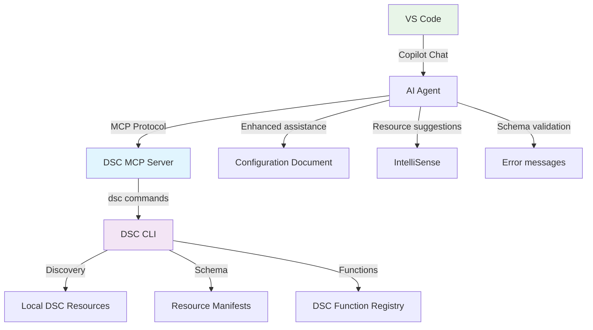

# Using DSC with Model Context Protocol (MCP) Server

Microsoft's Desired State Configuration (DSC) platform includes a built-in Model Context Protocol
(MCP) server that enables AI agents and development tools to interact with DSC resources and
configurations through a standardized interface. This integration provides intelligent assistance  
for discovering, invoking, and understanding DSC resources and functions on your system.

The DSC MCP server exposes DSC's core functionality to AI agents, enabling them to help you
discover resources, understand their schemas, and work with DSC functions in an intelligent way.
This enhances the overall authoring experience by providing contextual information about your
local DSC environment directly to AI-powered tools.

> [!IMPORTANT]
> The DSC MCP server is focused on discovery and information retrieval. It does not
> directly perform any configuration changes or resource modifications unless requested to do so.
> The information it provides to AI agents can be used to generate configurations and commands
> that, when executed, will impact your system. Always review and validate any generated
> content before execution.

## What is Model Context Protocol (MCP)?

Model Context Protocol (MCP) is an open standard that enables AI agents to securely connect to
external data sources and tools. To learn more about MCP and how it works with AI agents, see
[Use MCP servers in VS Code][00].

## How AI agents use DSC MCP tools

The DSC MCP server enables AI agents to intelligently assist you by understanding what's
available in your local DSC environment. Here's how agents use these capabilities to help
fulfill your requests:

### Discovering available resources

When you ask an agent to help with system configuration tasks, the agent can discover what DSC
resources are available on your machine. For example:

- **You ask**: "How can I manage Windows registry settings?"
- **Agent discovers**: The `Microsoft.Windows/Registry` resource is available
- **Agent provides**: Specific guidance on using that resource for your registry management
  needs

This discovery helps agents provide accurate, system-specific recommendations rather than
generic advice.

### Understanding resource capabilities

When you need to configure something specific, agents can examine the exact properties and
capabilities of relevant resources. For instance:

- **You ask**: "I need to install packages on my Linux system using apt"  
- **Agent examines**: The `Microsoft.Linux.Apt/Package` resource schema
- **Agent provides**: The exact property names and valid values needed for your package
  installation configuration

This ensures the guidance you receive matches what's actually available on your system.

### Working with DSC functions

When you're building configuration expressions, agents can discover what functions are available
to help solve your specific needs:

- **You ask**: "How do I combine multiple arrays in a DSC configuration?"
- **Agent discovers**: Functions like `union()`, `intersection()`, and `concat()` are available
- **Agent provides**: Examples using the appropriate function for your use case

This helps agents suggest the most suitable approach using your available DSC capabilities.

> [!NOTE]
> Additional MCP tools will become available in future releases to expand the capabilities
> of the DSC MCP server integration. For the latest updates and feature announcements,
> visit the [official DSC repository][01] on GitHub.

## How DSC MCP integrates with VS Code

The following diagram illustrates how the DSC MCP server integrates with VS Code and AI agents:



The integration works as follows:

1. **VS Code Copilot** communicates with AI agents that can access MCP servers
2. **AI agents** use the MCP protocol to query the DSC MCP server for information
3. **DSC MCP server** processes requests and calls the appropriate DSC CLI commands
4. **DSC CLI** performs resource discovery, schema retrieval, and function enumeration
5. **Results** flow back through the chain to provide enhanced authoring assistance

## Prerequisites

Before using the DSC MCP server integration, ensure you have:

- DSC v3.2.0-preview.5 or later installed on your system
- VS Code v1.104 or above with [GitHub Copilot extension][02] enabled
- Access to [Copilot in VS Code][03]

## Setting up DSC MCP Server

### Method 1: Using mcp.json configuration file

The recommended way to configure the DSC MCP server is through an `mcp.json` configuration file.
Create or update your MCP configuration file with the following content in the `.vscode` folder:

```json
{
  "servers": {
    "dsc-mcp": {
      "type": "stdio",
      "command": "dsc",
      "args": [
        "mcp"
      ]
    }
  },
  "inputs": []
}
```

This configuration tells MCP clients to:

- Run the `dsc mcp` command to start the DSC MCP server.
- Use standard I/O communication between the client and server.
- Register the server with the identifier `dsc-mcp`.

For detailed information about MCP configuration and setup in VS Code, refer to the
[official MCP documentation][04].

### Method 2: Manual command-line setup

You can also start the DSC MCP server manually for testing or development purposes:

```powershell
dsc mcp
```

This command starts the DSC MCP server and waits for MCP protocol messages on standard input.
The server will continue running until terminated or the input stream is closed.

:::image type="complex" source="media/dsc-mcp-server/dsc-mcp-startup.png" alt-text="Screenshot showing DSC MCP server startup in terminal":::
   This screenshot shows the DSC MCP server starting up in a PowerShell terminal window. The command `dsc mcp` has been executed and the server is running, waiting for MCP protocol messages on standard input.
:::image-end:::

## Using DSC MCP tools in VS Code

### Step 1: Open Copilot Chat in Agent Mode

1. Open the GitHub Copilot extension window in VS Code
2. Select "Agent Mode" to enable MCP tool integration

:::image type="complex" source="media/dsc-mcp-server/agent-mode-selection.png" alt-text="Screenshot showing Agent Mode selection in VS Code":::
   This screenshot shows the GitHub Copilot extension window in VS Code with Agent Mode being selected to enable MCP tool integration.
:::image-end:::

### Step 2: Access DSC MCP tools

1. Click on the tool icon in the GitHub Copilot chat window.
2. Search for "MCP Server: dsc-mcp" in the available tools list.
3. Verify that the DSC MCP server tools are available and loaded.

:::image type="complex" source="media/dsc-mcp-server/dsc-mcp-tools-selection.png" alt-text="Screenshot showing DSC MCP tools selection interface":::
   This screenshot shows the GitHub Copilot chat window with the tools list displayed, highlighting the DSC MCP server tools that are available for selection.
:::image-end:::

### Step 3: Start using DSC MCP integration

Begin asking questions or requesting assistance with DSC-related tasks. The AI agent will
automatically use the DSC MCP tools when appropriate to provide accurate, context-aware help.

Example prompts that work well with DSC MCP integration:

- "What DSC resources are available on this machine?"
- "Show me the schema for the Microsoft.Windows/Registry resource"
- "List all available DSC functions I can use in expressions"

:::image type="complex" source="media/dsc-mcp-server/dsc-mcp-usage-example.png" alt-text="Screenshot showing DSC MCP usage example in VS Code":::
   This screenshot demonstrates the DSC MCP integration in action, showing how AI agents use the MCP tools to provide contextual assistance with DSC-related tasks in VS Code.
:::image-end:::

## Troubleshooting

### Connection issues

If you encounter connection issues between VS Code and the DSC MCP server:

1. Verify your `mcp.json` configuration file syntax
2. Check that the `dsc` command is available in your system PATH
3. Review VS Code's output panel for detailed error messages
4. Try restarting the MCP integration in VS Code

### Limited or no response from AI Agent

If the AI agent doesn't seem to be using DSC MCP tools:

- Use specific prompts that clearly indicate you want DSC-related information
- Try phrases like "List DSC resources" or "Show me DSC functions"
- Verify that Agent Mode is enabled in Copilot Chat
- Check if the DSC MCP tools are visible in the tools list

## Limitations

> [!IMPORTANT]
> It is your responsibility to review all configuration documents and commands generated with
> AI assistance. **Always validate configurations in a test environment before applying them
> to production systems.**

Current limitations of the DSC MCP server integration include:

- **Local machine scope**: Information is limited to resources and functions available on the
  local machine where the server runs
- **Agent behavior**: There is no guarantee that AI agents will use DSC MCP tools for any
  particular query, though specific prompting can help guide tool usage

## See also

- [DSC Configuration document schema reference][05]
- [DSC resource manifest schema reference][06]
- [Use MCP servers in VS Code][00]
- [Model Context Protocol documentation][07]
- [Enhanced authoring with schemas][08]
- [Improving output accessibility][09]

<!-- Link reference definitions -->
[00]: https://code.visualstudio.com/docs/copilot/chat/mcp-servers
[01]: https://github.com/PowerShell/DSC
[02]: https://marketplace.visualstudio.com/items?itemName=GitHub.copilot
[03]: https://code.visualstudio.com/docs/copilot/overview
[04]: https://code.visualstudio.com/docs/copilot/customization/mcp-servers
[05]: ../reference/schemas/config/document.md
[06]: ../reference/schemas/resource/manifest/root.md
[07]: https://modelcontextprotocol.io/docs
[08]: enhanced-authoring.md
[09]: output-accessibility.md
