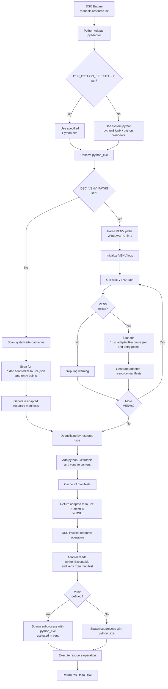

# Microsoft.Adapter/Python: Python DSC Resource Adapter

This RFC describes the design of the `Microsoft.Adapter/Python` DSC v3 adapter,
the `ms-dsc` Python SDK for resource authors, and the `Microsoft.Python/Discover`
discovery extension. Together these components allow DSC resources to be written
in Python and discovered/invoked through the standard DSC engine pipeline.

## Motivation

> As a system administrator or developer,
> I want to write DSC resources in Python using familiar language patterns,
> so that I can manage system state with DSC without learning Rust or PowerShell.

Python is a widely-used language for system automation, and a first-class Python
adapter lowers the barrier to writing portable DSC resources. Key goals are:

1. **Zero friction** — resource authors install one package (`ms-dsc`) and follow
   familiar Python patterns (dataclasses, typing, logging).
2. **No mandatory Rust or PowerShell dependency** — the entire adapter runtime is pure
   Python, stdlib only; it ships alongside the DSC binary.
3. **Discoverable by default** — resources are auto-discovered without needing to
   maintain hand-written manifest files.
4. **Idiomatic Python** — the SDK leverages dataclasses, type hints, structural
   protocols, and entry points.

## Proposed experience

A resource author creates a Python package with `ms-dsc` as a build-time
dependency:

```toml
[build-system]
requires = ["hatchling", "ms-dsc"]
build-backend = "hatchling.build"

[tool.hatch.build.hooks.dsc]
# Generates *.dsc.adaptedResource.json manifests at wheel-build time

[project]
dependencies = []  # ms-dsc is provided at runtime by DSC
```

They implement their resource by inheriting from `DscResource[T]` and implementing
the capability protocols they need:

```python
from dataclasses import dataclass, field
from collections.abc import Iterator
from ms_dsc import DscResource, dsc_resource, SetResult, TestResult
from ms_dsc.metadata import SetReturn, TestReturn
from ms_dsc.schema import DataclassSchemaProvider

@dataclass
class GreetingSchema:
    name: str = field(metadata={"description": "Name to greet."})
    message: str = field(default="", metadata={"description": "Greeting message."})

@dsc_resource(
    type="Example/Greeting",
    version="1.0.0",
    description="A resource that manages greeting messages.",
    tags=["example"],
    set_return=SetReturn.STATE_AND_DIFF,
    test_return=TestReturn.STATE_AND_DIFF,
)
class GreetingResource(DscResource[GreetingSchema]):
    schema_provider = DataclassSchemaProvider(GreetingSchema)

    def get(self, instance: GreetingSchema) -> GreetingSchema:
        return GreetingSchema(name=instance.name, message=f"Hello, {instance.name}!")

    def set(self, instance: GreetingSchema) -> SetResult[GreetingSchema]:
        actual = self.get(instance)
        changed = [f for f in ("message",) if getattr(actual, f) != getattr(instance, f)]
        return SetResult(actual_state=actual, changed_properties=changed)

    def test(self, instance: GreetingSchema) -> TestResult[GreetingSchema]:
        actual = self.get(instance)
        diffs = [f for f in ("message",) if getattr(actual, f) != getattr(instance, f)]
        return TestResult(actual_state=actual, differing_properties=diffs)

    def export(self, instance: GreetingSchema | None) -> Iterator[GreetingSchema]:
        for name in ("Alice", "Bob"):
            yield self.get(GreetingSchema(name=name))
```

After the package is built and installed, DSC automatically discovers the resource
through the `Microsoft.Python/Discover` extension. Manifests can also be generated
manually:

```bash
dsc-gen manifest
```

## Specification

### Components

Three cooperating components implement the Python adapter:

| Component | Shipped as | Purpose |
|-----------|------------|---------|
| `pyadapter` | Bundled with DSC | Adapter runtime invoked by DSC per operation |
| `ms-dsc` SDK | PyPI + bundled with DSC | Used by resource authors; provides `DscResource`, protocols, and schema generation |
| `Microsoft.Python/Discover` | Bundled with DSC | Discovery extension; scans Python distributions at DSC startup |

The `ms-dsc` SDK is bundled alongside `pyadapter` in the DSC install directory,
providing the SDK at runtime so resource packages do not need to declare it as a
runtime dependency.

### Platform manifests

Two adapter manifests provide cross-platform support:

| Manifest | Platform(s) | Executable |
|----------|-------------|-----------|
| `python.dsc.resource.json` | Windows | `python` |
| `python3.dsc.resource.json` | Linux, macOS | `python3` |

Both declare the resource type `Microsoft.Adapter/Python`. Only the appropriate
manifest is included in each platform's package.

### SDK public API

#### `DscResource[T]`

Base class for all Python DSC resources. `T` is the schema type (dataclass or
Pydantic model) that defines the resource's state.

#### Capability protocols

Capabilities are declared by implementing the corresponding methods. No explicit
interface inheritance is required.

| Protocol | Method signature | DSC capability |
|----------|-----------------|----------------|
| `Gettable` | `get(self, instance: T) -> T` | `get` |
| `Settable` | `set(self, instance: T) -> SetResult[T]` | `set` |
| `Testable` | `test(self, instance: T) -> TestResult[T]` | `test` |
| `Deletable` | `delete(self, instance: T) -> None` | `delete` |
| `Exportable` | `export(self, instance: T \| None) -> Iterator[T]` | `export` |

#### `@dsc_resource` decorator

Annotates a `DscResource` subclass with its DSC type identifier and behavioural
metadata:

```python
@dsc_resource(
    type="Vendor/ResourceName",   # Required: DSC resource type identifier
    version="1.0.0",              # Required: semver string
    description="...",            # Optional: resource description
    tags=["tag1", "tag2"],        # Optional: list of tags for discovery filtering
    set_return=SetReturn.STATE,   # Optional: STATE (default) or STATE_AND_DIFF
    test_return=TestReturn.STATE, # Optional: STATE (default) or STATE_AND_DIFF
)
```

#### Return types

```python
@dataclass
class SetResult(Generic[T]):
    actual_state: T
    changed_properties: list[str]  # Required when set_return=STATE_AND_DIFF

@dataclass
class TestResult(Generic[T]):
    actual_state: T
    differing_properties: list[str]  # Required when test_return=STATE_AND_DIFF
```

#### Schema providers

| Provider | Schema source | Additional requirement |
|----------|--------------|----------------------|
| `DataclassSchemaProvider` | Python dataclass | None (stdlib only) |
| `PydanticSchemaProvider` | Pydantic model | `pydantic` package |

#### Field metadata specification

**DataclassSchemaProvider:** Supports the following field metadata keys in the `metadata` dict:

| Key | Type | JSON schema target | Description |
|-----|------|-------------------|-------------|
| `description` | `str` | `description` | Human-readable description of the field for documentation. |
| `title` | `str` | `title` | Short display title for the field. |
| `examples` | `list` | `examples` | Array of example values for the field. |

**Example with dataclass:**

```python
from dataclasses import dataclass, field

@dataclass
class HostConnectionSchema:
    hostname: str = field(
        metadata={
            "description": "The target hostname or IP address.",
            "title": "Host",
            "examples": ["example.com", "192.168.1.1"]
        }
    )
    port: int = field(
        default=22,
        metadata={"description": "The SSH port to use.", "title": "Port"}
    )
```

**Generated JSON schema:**

```json
{
  "type": "object",
  "properties": {
    "hostname": {
      "type": "string",
      "description": "The target hostname or IP address.",
      "title": "Host",
      "examples": ["example.com", "192.168.1.1"]
    },
    "port": {
      "type": "integer",
      "description": "The SSH port to use.",
      "title": "Port",
      "default": 22
    }
  },
  "required": ["hostname"]
}
```

**PydanticSchemaProvider:** Delegates to Pydantic's `model_json_schema()` and supports all
Pydantic v2 field metadata and configuration options. See the [Pydantic documentation](https://docs.pydantic.dev/latest/concepts/json_schema/)
for complete reference.

Unknown metadata keys are silently ignored by `DataclassSchemaProvider` during schema generation.

### Adapted resource manifest format

Manifests are generated by `dsc-gen manifest` and packaged as package data at
`<package_name>/dsc/*.dsc.adaptedResource.json`. The `content` field is a JSON
object that encodes the Python module and class used for operation dispatch:

```json
{
  "manifestVersion": "1.0",
  "type": "Vendor/ResourceName",
  "version": "1.0.0",
  "description": "A resource that manages greeting messages.",
  "tags": ["example"],
  "adapter": {
    "type": "Microsoft.Adapter/Python"
  },
  "content": {
    "module": "vendor_resource.resource",
    "class": "ResourceClass"
  },
  "get": { "input": "stdin" },
  "set": { "input": "stdin", "return": "stateAndDiff" },
  "test": { "input": "stdin", "return": "stateAndDiff" },
  "schema": {
    "embedded": {
      "type": "object",
      "properties": {
        "name": {
          "type": "string",
          "description": "Name to greet."
        },
        "message": {
          "type": "string",
          "description": "Greeting message.",
          "default": ""
        }
      },
      "required": ["name"]
    }
  }
}
```

#### Runtime-aware cached manifests

When resources are discovered at runtime, the adapter adds two additional fields
to the `content` object before caching:

- `pythonExecutable` — the Python executable used to discover and invoke this resource (e.g., `python3.11`, `/usr/bin/python3.12`)
- `venv` — the virtual environment path where this resource was found (e.g., `/opt/venv1`)

These fields are **only present in cached adapted resource manifests** and are never
included in shipped manifests. They are added during discovery and enable the adapter
to invoke the resource in the correct Python runtime and virtual environment context.

**Cached manifest example:**

```json
{
  "manifestVersion": "1.0",
  "type": "Example/Greeting",
  "version": "1.0.0",
  "adapter": { "type": "Microsoft.Adapter/Python" },
  "content": {
    "module": "dsc_example_resource.resources",
    "class": "GreetingResource",
    "pythonExecutable": "python3.11",
    "venv": "/opt/venv1"
  },
  "get": { "input": "stdin" },
  "schema": { "embedded": { } }
}
```

### Stdin/stdout contract

The adapter reads a JSON object from stdin and writes results to stdout as
newline-delimited JSON (NDJSON). Unknown input fields are silently ignored.

| Operation | stdin | stdout lines |
|-----------|-------|-------------|
| `get` | Desired state | 1 — actual state |
| `set` (STATE) | Desired state | 1 — actual state |
| `set` (STATE_AND_DIFF) | Desired state | 2 — actual state, then `["changedProp", ...]` |
| `test` (STATE) | Desired state | 1 — actual state |
| `test` (STATE_AND_DIFF) | Desired state | 2 — actual state, then `["differingProp", ...]` |
| `delete` | Desired state | 0 |
| `export` | Filter or `{}` | 0..N — one object per instance |

### Discovery mechanism

Two discovery paths are supported:

**Extension-based (preferred):** The `Microsoft.Python/Discover` extension scans
installed Python distributions for `*.dsc.adaptedResource.json` files packaged
as data in a `<package>/dsc/` directory. This requires the resource to ship
manifests generated by `dsc-gen manifest`.

**List command (fallback):** The adapter's `list` command enumerates Python
distributions that declare a `microsoft.dsc.resources` entry point group, and
returns the resource list to DSC. This supports development installs and resources
without pre-built manifests.

### Logging contract

Resource authors use Python's standard `logging` module. The adapter translates
log records to DSC's structured JSON stderr format before dispatching any
operation:

```json
{"info": "vendor_resource.resource: Getting /tmp/hello.txt"}
```

Log verbosity is controlled by the `DSC_TRACE_LEVEL` environment variable
(`trace` / `debug` / `info` / `warn` / `error`).

### Discovery and invocation flow



### Multi-runtime and virtual environment support

The adapter supports resource discovery and execution across multiple Python runtimes
and virtual environments, enabling operators to manage resource placement and isolation
independently of package installation.

#### Operator configuration

Operators control runtime and VENV behavior via environment variables:

| Variable | Platform | Purpose | Example |
|----------|----------|---------|----------|
| `DSC_PYTHON_EXECUTABLE` | All | Specifies the Python executable to use | `python3.11`, `/usr/bin/python3.12` |
| `DSC_VENV_PATHS` | All | Platform-delimited list of virtual environment paths | Windows: `C:\venv1;C:\venv2` / Unix: `/opt/venv1:/opt/venv2` |

**Defaults:**
- If `DSC_PYTHON_EXECUTABLE` is not set, the adapter uses the system Python (`python` on Windows, `python3` on Unix)
- If `DSC_VENV_PATHS` is not set, resource discovery searches only system site-packages

**Path delimiters:**
- Windows: semicolon (`;`)
- Unix (Linux, macOS): colon (`:`)

#### Discovery flow

1. Resolve the Python executable from `DSC_PYTHON_EXECUTABLE` env var; fallback to system default
2. If `DSC_VENV_PATHS` is set, parse it into a list of paths using the platform-specific delimiter
3. For each VENV path (in order):
   - Validate the VENV exists; skip with a warning if not
   - Scan for pre-built `*.dsc.adaptedResource.json` manifests in `<venv>/lib/pythonX.Y/site-packages/*/dsc/`
   - If no manifests found, run the adapter's `list` command in a subprocess with that VENV activated
   - Collect all discovered resources and tag them with the source VENV path
4. If no VENVs specified, scan system site-packages using the same process
5. Deduplicate resources by type and version; last VENV wins (priority order respects list order)
6. Cache all discovered manifests with the `pythonExecutable` and `venv` fields added to each
7. Cache key includes the hash of (pythonExecutable, VENV paths) to invalidate when configuration changes

#### Runtime invocation

When DSC invokes a resource operation:

1. The adapter loads the cached adapted resource manifest and reads `pythonExecutable` and `venv`
2. Spawns a subprocess using the specified `pythonExecutable`
3. If `venv` is present, activates the VENV by setting `VIRTUAL_ENV` and adjusting `PATH` in the subprocess environment
4. Executes the resource operation (get, set, test, etc.) in that Python context

#### Error handling

| Scenario | Behavior |
|----------|----------|
| VENV path in `DSC_VENV_PATHS` doesn't exist | Skip with warning; continue to next VENV |
| Python executable not found | Fallback to system default; log warning |
| Permission denied on VENV | Skip with warning; continue |
| No resources found in any VENV | Return empty list |
| Invalid `DSC_PYTHON_EXECUTABLE` path | Raise error; operator must fix configuration |
| Multiple VENVs have the same resource type | Use first match (respects priority order) |

## Alternate Proposals and Considerations

### Alternative A: Single Python file adapter

A single-file adapter is simpler to ship but limits testability and extensibility.
Rejected in favour of the package-based adapter structure.

### Alternative B: Require Pydantic for all resources

Pydantic provides excellent runtime validation. Rejected as a hard requirement
because many resources are simple and don't need Pydantic's overhead. Pydantic
remains an optional, fully-supported schema backend.
