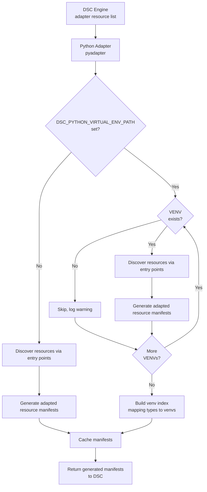

# Microsoft.Adapter/Python: Python DSC Resource Adapter

This RFC describes the design of the `Microsoft.Adapter/Python` DSC v3 adapter,
the `ms-dsc` Python SDK for resource authors, and the `Microsoft.Python/Discover`
discovery extension. Together these components allow DSC resources to be written
in Python and discovered/invoked through the standard DSC engine pipeline.

## Motivation

> As a system administrator or developer,
> I want to write DSC resources in Python using familiar language patterns,
> so that I can manage system state with DSC without learning Rust or PowerShell.

Python is a widely-used language for system automation, and a first-class Python
adapter lowers the barrier to writing portable DSC resources. Key goals are:

1. **Zero friction** — resource authors install one package (`ms-dsc`) and follow
   familiar Python patterns (dataclasses, typing, logging).
2. **No mandatory Rust or PowerShell dependency** — the entire adapter runtime is pure
   Python, stdlib only; it ships alongside the DSC binary.
3. **Discoverable by default** — resources are auto-discovered without needing to
   maintain hand-written manifest files.
4. **Idiomatic Python** — the SDK leverages dataclasses, type hints, structural
   protocols, and entry points.

## Proposed experience

A resource author creates a Python package with `ms-dsc` as a build-time
dependency:

```toml
[build-system]
requires = ["hatchling", "ms-dsc"]
build-backend = "hatchling.build"

[tool.hatch.build.hooks.dsc]
# Generates *.dsc.adaptedResource.json manifests at wheel-build time

[project]
name = "example-greeting-resource"
dependencies = []  # ms-dsc is provided at runtime by DSC

[project.entry-points."microsoft.dsc.resources"]
# Key is a unique slug per distribution; the canonical DSC type name comes from @dsc_resource
greeting = "example_greeting.resource:GreetingResource"
```

They implement their resource by inheriting from `DscResource[T]` and implementing
the capability protocols they need:

```python
from dataclasses import dataclass, field
from collections.abc import Iterator
from ms_dsc import DscResource, dsc_resource, SetResult, TestResult
from ms_dsc.metadata import SetReturn, TestReturn
from ms_dsc.schema import DataclassSchemaProvider

@dataclass
class GreetingSchema:
    name: str = field(metadata={"description": "Name to greet."})
    message: str = field(default="", metadata={"description": "Greeting message."})

@dsc_resource(
    type="Example/Greeting",
    version="1.0.0",
    description="A resource that manages greeting messages.",
    tags=["example"],
    set_return=SetReturn.STATE_AND_DIFF,
    test_return=TestReturn.STATE_AND_DIFF,
)
class GreetingResource(DscResource[GreetingSchema]):
    schema_provider = DataclassSchemaProvider(GreetingSchema)

    def get(self, instance: GreetingSchema) -> GreetingSchema:
        return GreetingSchema(name=instance.name, message=f"Hello, {instance.name}!")

    def set(self, instance: GreetingSchema) -> SetResult[GreetingSchema]:
        actual = self.get(instance)
        changed = [f for f in ("message",) if getattr(actual, f) != getattr(instance, f)]
        return SetResult(actual_state=actual, changed_properties=changed)

    def test(self, instance: GreetingSchema) -> TestResult[GreetingSchema]:
        actual = self.get(instance)
        diffs = [f for f in ("message",) if getattr(actual, f) != getattr(instance, f)]
        return TestResult(actual_state=actual, differing_properties=diffs)

    def export(self, instance: GreetingSchema | None) -> Iterator[GreetingSchema]:
        for name in ("Alice", "Bob"):
            yield self.get(GreetingSchema(name=name))
```

After the package is built and installed, DSC automatically discovers the resource
through the `Microsoft.Python/Discover` extension. Manifests can also be generated
manually:

```bash
dsc-gen manifest
```

`dsc-gen manifest` invokes the same manifest generation logic as the Hatchling build
hook. It reads the `microsoft.dsc.resources` entry points from `pyproject.toml`, loads
each registered class, inspects `@dsc_resource` metadata and implemented protocols via
`isinstance()`, and writes `*.dsc.adaptedResource.json` files into `<package_name>/dsc/`.
The `author` field is populated from `project.authors` in `pyproject.toml`.

## Specification

### Components

Three cooperating components implement the Python adapter:

| Component | Shipped as | Purpose |
|-----------|------------|---------|
| `pyadapter` | Bundled with DSC | Adapter runtime invoked by DSC per operation |
| `ms-dsc` SDK | PyPI + bundled with DSC | Used by resource authors; provides `DscResource`, protocols, and schema generation |
| `Microsoft.Python/Discover` | Bundled with DSC | Discovery extension; scans Python distributions at DSC startup |

The `ms-dsc` SDK serves two roles. At build time, it provides the Hatchling build hook
(`[tool.hatch.build.hooks.dsc]`) that reads entry points and `@dsc_resource` metadata
to generate adapted resource manifests. At runtime, DSC bundles `ms-dsc` alongside
`pyadapter` in its install directory so resource packages do not need to declare it as
a runtime dependency.

### Platform manifests

Two adapter manifests provide cross-platform support:

| Manifest | Platform(s) | Executable |
|----------|-------------|-----------|
| `python.dsc.resource.json` | Windows | `python` |
| `python3.dsc.resource.json` | Linux, macOS | `python3` |

Both declare the resource type `Microsoft.Adapter/Python`. Only the appropriate
manifest is included in each platform's package.

### SDK public API

#### `DscResource[T]`

Base class for all Python DSC resources. `T` is the schema type (dataclass or
Pydantic model) that defines the resource's state.

#### Capability protocols

Capabilities are declared by implementing the corresponding methods. No explicit
interface inheritance is required. All protocols are `@runtime_checkable`; the adapter
and `dsc-gen` use `isinstance()` to detect which capabilities a resource class implements.

| Protocol | Method signature | DSC capability |
|----------|-----------------|----------------|
| `Gettable` | `get(self, instance: T) -> T` | `get` |
| `Settable` | `set(self, instance: T) -> SetResult[T]` | `set` |
| `Testable` | `test(self, instance: T) -> TestResult[T]` | `test` |
| `Deletable` | `delete(self, instance: T) -> None` | `delete` |
| `Exportable` | `export(self, instance: T \| None) -> Iterator[T]` | `export` |

> **`export` instance parameter:** DSC passes `None` when requesting all instances.
> Resource authors may optionally use a non-`None` value as a filter or seed
> (e.g., to scope export to instances matching a partial state).

#### `@dsc_resource` decorator

Annotates a `DscResource` subclass with its DSC type identifier and behavioural
metadata:

```python
@dsc_resource(
    type="Vendor/ResourceName",   # Required: DSC resource type identifier
    version="1.0.0",              # Required: semver string
    description="...",            # Optional: resource description
    tags=["tag1", "tag2"],        # Optional: list of tags for discovery filtering
    set_return=SetReturn.STATE,   # Optional: STATE (default) or STATE_AND_DIFF
    test_return=TestReturn.STATE, # Optional: STATE (default) or STATE_AND_DIFF
)
```

#### Return types

```python
@dataclass
class SetResult(Generic[T]):
    actual_state: T
    changed_properties: list[str]  # Required when set_return=STATE_AND_DIFF

@dataclass
class TestResult(Generic[T]):
    actual_state: T
    differing_properties: list[str]  # Required when test_return=STATE_AND_DIFF
```

#### Schema providers

| Provider | Schema source | Additional requirement |
|----------|--------------|----------------------|
| `DataclassSchemaProvider` | Python dataclass | None (stdlib only) |
| `PydanticSchemaProvider` | Pydantic model | `pydantic` package |

#### Field metadata specification

**DataclassSchemaProvider:** Supports the following field metadata keys in the `metadata` dict:

| Key | Type | JSON schema target | Description |
|-----|------|-------------------|-------------|
| `description` | `str` | `description` | Human-readable description of the field for documentation. |
| `title` | `str` | `title` | Short display title for the field. |
| `examples` | `list` | `examples` | Array of example values for the field. |

**Example with dataclass:**

```python
from dataclasses import dataclass, field

@dataclass
class HostConnectionSchema:
    hostname: str = field(
        metadata={
            "description": "The target hostname or IP address.",
            "title": "Host",
            "examples": ["example.com", "192.168.1.1"]
        }
    )
    port: int = field(
        default=22,
        metadata={"description": "The SSH port to use.", "title": "Port"}
    )
```

**Generated JSON schema:**

```json
{
  "type": "object",
  "properties": {
    "hostname": {
      "type": "string",
      "description": "The target hostname or IP address.",
      "title": "Host",
      "examples": ["example.com", "192.168.1.1"]
    },
    "port": {
      "type": "integer",
      "description": "The SSH port to use.",
      "title": "Port",
      "default": 22
    }
  },
  "required": ["hostname"]
}
```

**PydanticSchemaProvider:** Delegates to Pydantic's `model_json_schema()` and supports all
Pydantic v2 field metadata and configuration options. See the [Pydantic documentation](https://docs.pydantic.dev/latest/concepts/json_schema/)
for complete reference.

Unknown metadata keys are silently ignored by `DataclassSchemaProvider` during schema generation.

### Adapted resource manifest format

Manifests are generated by `dsc-gen manifest` and packaged as package data at
`<package_name>/dsc/*.dsc.adaptedResource.json`. Manifests follow the DSC adapted
resource manifest schema. The `content` property encodes the Python module and class
the adapter uses for direct operation dispatch, bypassing entry-point lookup at
invocation time:

```json
{
  "$schema": "https://aka.ms/dsc/schemas/v3/bundled/adaptedresource/manifest.json",
  "type": "Vendor/ResourceName",
  "kind": "resource",
  "version": "1.0.0",
  "description": "A resource that manages greeting messages.",
  "author": "Example Corp",
  "capabilities": ["get", "set", "test", "export"],
  "requireAdapter": "Microsoft.Adapter/Python",
  "content": {
    "module": "vendor_resource.resource",
    "class": "ResourceClass"
  },
  "schema": {
    "embedded": {
      "$schema": "http://json-schema.org/draft-07/schema#",
      "type": "object",
      "properties": {
        "name": {
          "type": "string",
          "description": "Name to greet."
        },
        "message": {
          "type": "string",
          "description": "Greeting message.",
          "default": ""
        }
      },
      "required": ["name"]
    }
  }
}
```

The `content` property contains an adapter-specific metadata object that encodes the Python
module and class information needed for operation dispatch:

```json
{
  "module": "vendor_resource.resource",
  "class": "ResourceClass"
}
```

Capabilities are derived from the resource's implemented methods at manifest-generation time
(e.g., if the class has a `set()` method, `"set"` is included in `capabilities`).

#### Adapter-generated manifest cache

Manifests discovered via the extension (shipped with packages) are NOT cached; they
are referenced in-place and remain immutable for signature verification.

Manifests generated at runtime by the adapter's `list` command (for resources
discovered via entry points) are cached to avoid regeneration on every discovery.

Runtime venv bindings for all discovered resources (both shipped and generated) are
stored in a separate venv index file (see below), enabling DSC to invoke resources
in the correct virtual environment context while keeping shipped manifests immutable
and signature-safe.

**Adapter-generated manifest cache locations:**
- **Windows:** `%LOCALAPPDATA%\dsc\python-adapter-manifest-cache.json`
- **Linux/macOS:** `$HOME/.dsc/python-adapter-manifest-cache.json`

**Cache format:**
A JSON object mapping resource identifiers (`Type@Version`) to their generated manifests:

```json
{
  "version": "1.0",
  "venv_paths": ["/opt/venv1", "/opt/venv2"],
  "manifests": {
    "Example/Greeting@1.0.0": { /* full adapted resource manifest */ },
    "Example/Service@1.0.0": { /* full adapted resource manifest */ }
  }
}
```

#### Virtual environment index cache

Virtual environment bindings are stored in a separate index file to keep manifests
immutable and signature-safe. The index maps resource types to their virtual environment
paths. Cache is stored per-user (consistent with the PowerShell adapter pattern).

**Index file locations:**
- **Windows:** `%LOCALAPPDATA%\dsc\python-venv-index.json`
- **Linux/macOS:** `$HOME/.dsc/python-venv-index.json`

**Index file format:**

The index maps each discovered resource (identified by type and version) to its
source virtual environment(s) using the canonical `Type@Version` format. This allows 
multiple versions of the same resource to be discovered across different VENVs, and
multiple locations for the same resource version (for DSC engine to select); 
DSC engine handles deduplication and selection.

```json
{
  "version": "1.0",
  "index": {
    "Example/Greeting@1.0.0": ["/opt/venv1", "/opt/venv2"],
    "Example/Greeting@2.0.0": ["/opt/venv2"],
    "Example/Service@1.0.0": ["/opt/venv2"],
    "Example/Config@1.0.0": null
  }
}
```

| Field | Description |
|-------|-------------|
| `version` | Index format version |
| `index` | Object mapping resource identifiers to venv path(s). Format: `Type@Version` → string[] or null (e.g., `"Microsoft.Windows/Service@1.0.0"` → `["/path/to/venv"]` or `["/venv1", "/venv2"]` for multiple locations; `null` for system Python). Multiple versions and multiple locations of the same resource can coexist. |

**Venv index generation:**
- Created during discovery after all resources are found (both via extension and adapter list command)
- Never shipped with packages; runtime-only cache artifact

**Index invalidation:**
The venv index is maintained across discovery cycles, but validated each time:
- On each discovery cycle, verify all venv paths in the cached index still exist on the filesystem
- Remove any venv entries where paths no longer exist
- If new venvs appear in `DSC_PYTHON_VIRTUAL_ENV_PATH`, discover resources from those venvs and add to index
- If all venvs are gone or the index is empty, fall back to system Python only and log a warning

### Discovery mechanism

Two discovery paths are supported:

**Extension-based (preferred):** The `Microsoft.Python/Discover` extension scans
installed Python distributions for adapted resource manifest files packaged
as data in a `<package>/dsc/` directory using the manifest file extensions passed
via the `extensionsArg` discovery argument. This requires the resource to ship
manifests, either generated by `dsc-gen manifest` or hand-authored.

**List command (fallback):** The adapter's `list` command enumerates Python
distributions that declare a `microsoft.dsc.resources` entry point group, and
returns the resource list to DSC. This generates manifests at runtime for resources
discovered via entry points.

### Logging contract

Resource authors use Python's standard `logging` module. The adapter translates
log records to DSC's structured JSON stderr format before dispatching any
operation:

```json
{"info": "vendor_resource.resource: Getting /tmp/hello.txt"}
```

Log verbosity is controlled by the `DSC_TRACE_LEVEL` environment variable
(`trace` / `debug` / `info` / `warn` / `error`).

### Adapter-generated manifest discovery flow

The following flow describes discovery of resources via the adapter's `list` command
(entry-point discovered resources without pre-built manifests). Shipped manifests
from the discovery extension follow the standard DSC discovery priority.



### Multi-runtime and virtual environment support

The adapter supports resource discovery and execution across multiple Python runtimes
and virtual environments, enabling operators to manage resource placement and isolation
independently of package installation.

#### Operator configuration

Operators control VENV behavior via environment variables:

| Variable | Platform | Purpose | Example |
|----------|----------|---------|----------|
| `DSC_PYTHON_VIRTUAL_ENV_PATH` | All | Platform-delimited list of virtual environment paths | Windows: `C:\venv1;C:\venv2` / Unix: `/opt/venv1:/opt/venv2` |

**Defaults:**
- If `DSC_PYTHON_VIRTUAL_ENV_PATH` is not set, resource discovery searches only system site-packages

**Path delimiters:**
- Uses the platform's standard path separator (e.g., `;` on Windows, `:` on Unix)

#### Adapter list command discovery flow

When DSC engine falls back to the adapter's `list` command for discovery:

1. If `DSC_PYTHON_VIRTUAL_ENV_PATH` is set, parse it into a list of paths using the platform-specific delimiter
2. For each VENV path (in order):
   - Validate the VENV exists; skip with a warning if not
   - Run the adapter's `list` command in a subprocess with that VENV activated to discover resources via entry points
   - Collect all discovered resources and track their source VENV path
3. If no VENVs specified, run the adapter's `list` command to discover resources via entry points in system site-packages (venv=`null`)
4. Generate adapted resource manifests for all discovered resources (no deduplication)
5. Cache generated manifests to avoid regeneration on next discovery
6. Build a venv index mapping each resource's canonical identifier `Type@Version` to its source VENV path
7. Validate cached venv index: remove entries for venvs that no longer exist on the filesystem
8. Cache both generated manifests and updated venv index
9. Return generated manifests to DSC engine

#### Runtime invocation

When DSC engine invokes a Python resource operation:

1. DSC has the adapted resource manifest (from shipped or generated sources)
2. DSC constructs the canonical resource identifier `Type@Version` from the manifest
3. DSC looks up this identifier in the venv index to determine the target Python environment
4. DSC invokes the adapter with:
   - The manifest
   - The venv path (if found in index) or `null` for system Python
   - The operation (get, set, test, delete, export)
   - The desired state (stdin)
5. The adapter:
   - Selects the appropriate Python executable based on venv path
   - Spawns a subprocess with that executable if venv is specified
   - Loads the resource module/class from manifest
   - Invokes the operation and returns results (stdout/stderr)
6. DSC processes the results

#### Adapter-generated manifest cache invalidation

The manifest cache is invalidated when:
- Cached venv index contains stale paths (venvs no longer exist on filesystem)
- The current `DSC_PYTHON_VIRTUAL_ENV_PATH` value differs from the `venv_paths` recorded in the cache (paths added or removed)

If the manifest cache is missing or corrupted, the adapter regenerates manifests on next discovery.

#### Error handling

| Scenario | Behavior |
|----------|----------|
| VENV path in `DSC_PYTHON_VIRTUAL_ENV_PATH` doesn't exist | Skip with warning; continue to next VENV |
| Permission denied on VENV | Skip with warning; continue |
| No resources found in any VENV | Return empty list |
| Multiple VENVs have the same resource (`Type@Version`) | All are discovered; DSC engine selects which to use |
| Adapter-generated manifest cache missing or corrupted | Regenerate manifests on next discovery |
| Venv index missing or corrupted | Log warning; DSC uses system Python for invocation |
| Resource identifier (`Type@Version`) not found in index | Log warning; DSC falls back to system Python for that resource |

## Alternate Proposals and Considerations

### Alternative A: Single Python file adapter

A single-file adapter is simpler to ship but limits testability and extensibility.
Rejected in favor of the package-based adapter structure.

### Alternative B: Require Pydantic for all resources

Pydantic provides excellent runtime validation. Rejected as a hard requirement
because many resources are simple and don't need Pydantic's overhead. Pydantic
remains an optional, fully-supported schema backend.
